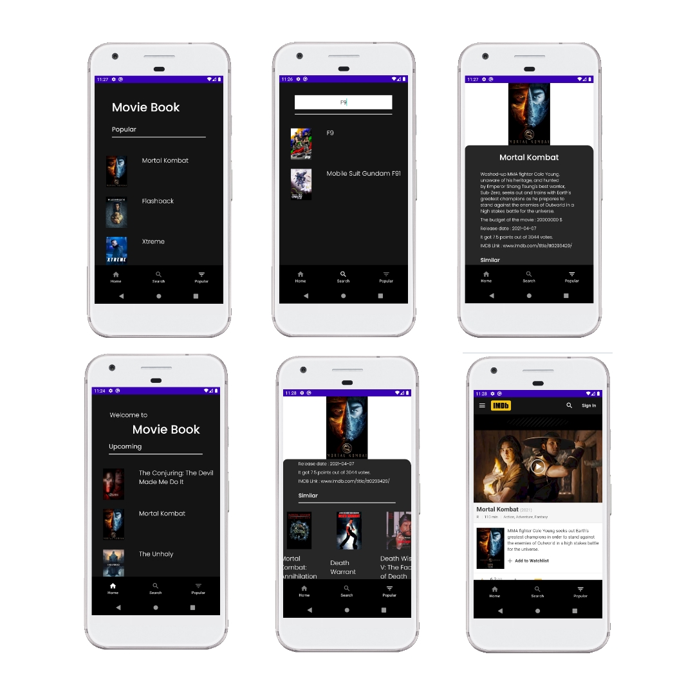

# MovieBook

Android App using [The Movie DB API](https://www.themoviedb.org)

## App screenshots

## Description

A simple app with some basic functions. It connects to the Movies DB API and displays popular movies and upcoming movies available on TMDb. You can also look at the details of these movies and, if desired, connect to IMDB pages with webView from within the application. You can search for the movie you want by name within the application.

## Tech Stack

MVVM

Hilt - Used to provide dependency injection

Retrofit 2 - OkHttp3 - request/response API

Glide - for image loading.

LiveData - use LiveData to see UI update with data changes.

Data Binding - bind UI components in layouts to data sources

Firebase analytics - To log movie details.

